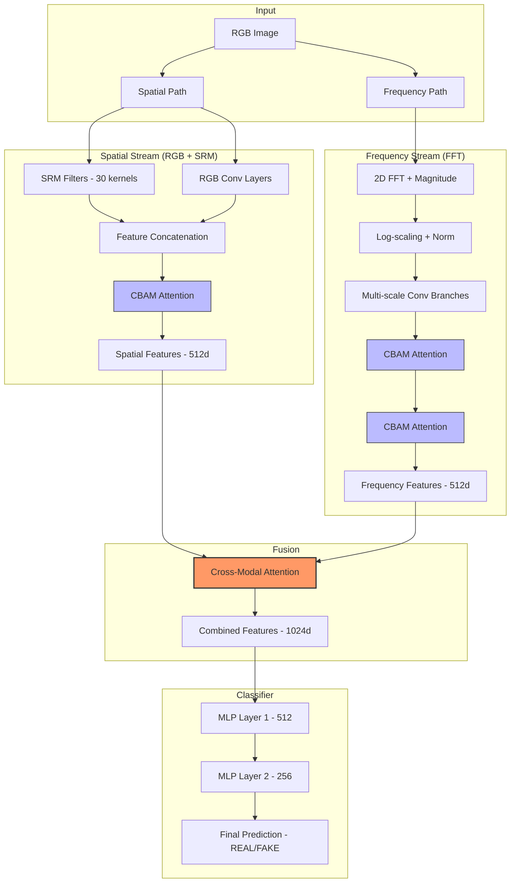

# Tài liệu Kỹ thuật: Dual-Stream CNN Enhanced (New Architecture)

Mô hình **Dual-Stream CNN Enhanced** là kiến trúc tiên tiến nhất trong hệ thống phát hiện ảnh AI-generated. Kiến trúc này kết hợp phân tích không gian (Spatial), phân tích tần số (Frequency) và các cơ chế chú ý (Attention) để phát hiện những dấu vết (artifacts) vi mô mà mắt người không thể nhìn thấy.

## 1. Sơ đồ Kiến trúc (Architecture Diagram)

---

## 2. Kiến trúc Tổng quát (High-Level Architecture)

Kiến trúc gồm 2 nhánh chính chạy song song:
1.  **Spatial Stream (Luồng Không gian)**: Phân tích các chi tiết bề mặt, màu sắc và nhiễu vi mô (thông qua SRM filters).
2.  **Frequency Stream (Luồng Tần số)**: Phân tích phổ FFT để tìm các lỗi lặp lại trong quá trình upsampling của AI.

Sự kết hợp được thực hiện thông qua **Cross-Modal Attention** trước khi đưa vào bộ phân loại cuối cùng.

---

## 2. Nhánh Spatial (Spatial Stream)

### 2.1. SRM (Steganalysis Rich Model) Filters
Nhánh này sử dụng 30 bộ lọc SRM cố định để trích xuất các đặc trưng nhiễu (noise patterns).
*   **Công thức**: $O_{SRM} = I * K_{SRM}$
    Trong đó $K_{SRM}$ là các hạt nhân (kernels) High-pass chuyên dụng để bắt các thay đổi đột ngột giữa các pixel lân cận.
*   **Mục đích**: Phát hiện các artifact do nén, chỉnh sửa hoặc do thuật toán tạo ảnh gây ra ở mức độ pixel.

### 2.2. CBAM (Convolutional Block Attention Module)
Đặc trưng không gian được tinh lọc qua cơ chế CBAM bao gồm:
*   **Channel Attention**: Tập trung vào "cái gì" quan trọng (filters nào mang nhiều thông tin).
*   **Spatial Attention**: Tập trung vào "ở đâu" quan trọng (vùng nào trong ảnh có dấu hiệu giả mạo).

---

## 3. Nhánh Frequency (Frequency Stream)

### 3.1. FFT Magnitude Spectrum
Ảnh RGB được chuyển sang thang độ xám (Grayscale) và thực hiện biến đổi Fourier 2 chiều.
*   **Công thức**: $F(u, v) = \sum_{x=0}^{M-1} \sum_{y=0}^{N-1} f(x, y) e^{-j 2\pi (\frac{ux}{M} + \frac{vy}{N})}$
*   **Hàm Log**: $S = \log(1 + |F(u, v)|)$ để nén dải động của phổ, giúp CNN dễ học hơn.

### 3.2. Multi-scale Frequency Analysis
Luồng tần số được chia làm 3 nhánh nhỏ (Branch 1, 2, 3) với kích thước kernel khác nhau (1x1, 3x3, 5x5) để nắm bắt các pattern tần số ở nhiều mức độ chi tiết (từ thấp đến cao).

---

## 4. Cơ chế Fusion: Cross-Modal Attention

Đây là "trái tim" của sự cải tiến, giúp hai luồng thông tin tương tác với nhau thay vì chỉ cộng dồn.

*   **Query (Q)**: Trích xuất từ Spatial features.
*   **Key (K) & Value (V)**: Trích xuất từ Frequency features.
*   **Công thức Attention**:
    $$\text{Attention}(Q, K, V) = \text{Softmax}\left(\frac{QK^T}{\sqrt{d_k}}\right)V$$
*   **Ý nghĩa**: Thông tin tần số sẽ "chỉ dẫn" cho luồng không gian biết vùng nào trong ảnh đang có sự bất thường về phổ, từ đó tăng cường độ nhạy của mô hình.

---

## 5. Bộ phân loại (Classifier)

Features sau khi Fusion (1024-d) được đưa qua chuỗi các lớp Fully Connected:
1.  **FC1**: 1024 -> 512 (BatchNorm + ReLU + Dropout)
2.  **FC2**: 512 -> 256 (BatchNorm + ReLU + Dropout)
3.  **Output**: 256 -> 1 (Sigmoid cho nhị phân REAL/FAKE)

---

## 6. Ưu điểm vượt trội
*   **Robustness**: Nhờ SRM filters, mô hình không bị đánh lừa bởi các ảnh đã qua xử lý hậu kỳ (nén JPG, Blur).
*   **Interpretability**: Cơ chế Attention cho phép trực quan hóa vùng ảnh mà mô hình đang tập trung vào.
*   **Accuracy**: Đạt độ chính xác cao trên các tập dữ liệu hiện đại như ArtiFact nhờ khả năng "học" được dấu vân tay của các mô hình Diffusion (Gemini, Midjourney).

---

## 7. Phụ lục: Công thức Toán học chi tiết

### 7.1. Cơ chế Chú ý CBAM (Convolutional Block Attention Module)

CBAM kết hợp hai loại chú ý để tinh lọc đặc trưng:

1.  **Channel Attention ($M_c$):**
    $$M_c(F) = \sigma(MLP(AvgPool(F)) + MLP(MaxPool(F)))$$
    Trong đó $\sigma$ là hàm Sigmoid, $F$ là đặc trưng đầu vào. Cơ chế này giúp mô hình chọn lọc các kênh (channels) chứa thông tin artifacts quan trọng nhất.

2.  **Spatial Attention ($M_s$):**
    $$M_s(F) = \sigma(f^{7 \times 7}([AvgPool(F); MaxPool(F)]))$$
    Trong đó $f^{7 \times 7}$ đại diện cho phép tích chập với kích thước hạt nhân $7 \times 7$. Cơ chế này tạo ra một bản đồ trọng số không gian để đánh dấu vùng ảnh bị nghi ngờ là giả mạo.

### 7.2. Xử lý Tần số (FFT Processing)

Quá trình chuyển đổi và chuẩn hóa phổ tần số:
1.  **Magnitude**: $|F(u,v)| = \sqrt{Re(F(u,v))^2 + Im(F(u,v))^2}$
2.  **Log-scaling**: $S = \ln(1 + |F(u,v)|)$
3.  **Min-Max Normalization**: 
    $$S_{norm} = \frac{S - \min(S)}{\max(S) - \min(S) + \epsilon}$$

### 7.3. Cross-Modal Attention (Transformer style)

Sử dụng cơ chế Query (Q), Key (K), Value (V) để kết hợp hai miền dữ liệu:
*   **Query**: $Q = W_Q \cdot F_{spatial}$
*   **Key**: $K = W_K \cdot F_{freq}$
*   **Value**: $V = W_V \cdot F_{freq}$
*   **Công thức Tổng quát**:
    $$\text{Enhanced\_Spatial} = F_{spatial} + \text{Softmax}\left(\frac{Q \cdot K^T}{\sqrt{d_k}}\right) \cdot V$$
    Trong đó $\sqrt{d_k}$ là hệ số tỉ lệ (scaling factor) để ổn định gradient trong quá trình huấn luyện.

### 7.4. Hàm tối ưu (Loss Function)

Sử dụng Binary Cross Entropy (BCE) kết hợp với Label Smoothing ($\alpha$):
$$L = -\frac{1}{N} \sum_{i=1}^N [y_i' \log(p_i) + (1 - y_i') \log(1 - p_i)]$$
Trong đó $y_i' = y_i(1 - \alpha) + 0.5\alpha$ là nhãn sau khi đã làm mịn để tăng khả năng tổng quát hóa của mô hình.
